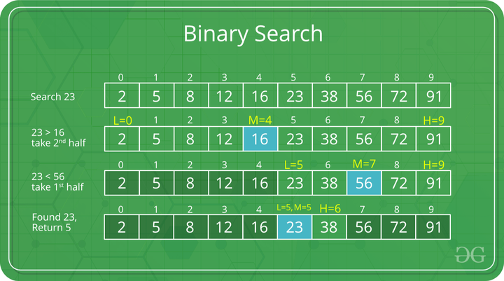

How does Binary Search work?

Consider an array arr[] = {2, 5, 8, 12, 16, 23, 38, 56, 72, 91}, and the target = 23.

First Step: Calculate the mid and compare the mid element with the key. If the key is less than mid element, move to left and if it is greater than the mid then move search space to the right.

Key (i.e., 23) is greater than current mid element (i.e., 16). The search space moves to the right.
Key is less than the current mid 56. The search space moves to the left.

Second Step: If the key matches the value of the mid element, the element is found and stop search.
