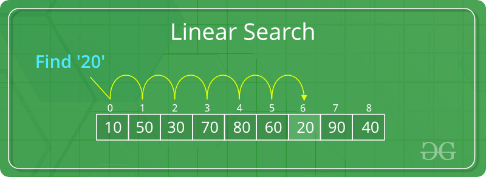

## How Does Linear Search Algorithm Work?

In Linear Search Algorithm,

Every element is considered as a potential match for the key and checked for the same.
If any element is found equal to the key, the search is successful and the index of that element is returned.
If no element is found equal to the key, the search yields “No match found”.
For example: Consider the array arr[] = {10, 50, 30, 70, 80, 20, 90, 40} and key = 30
