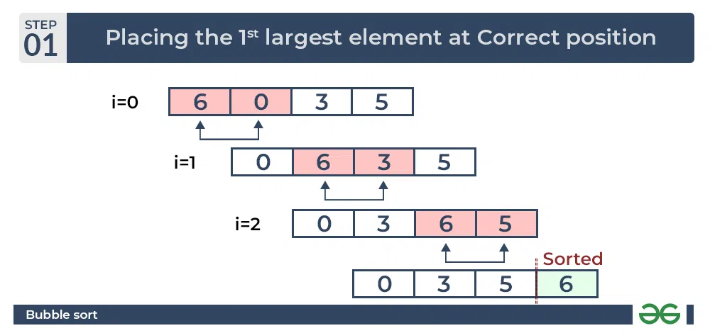
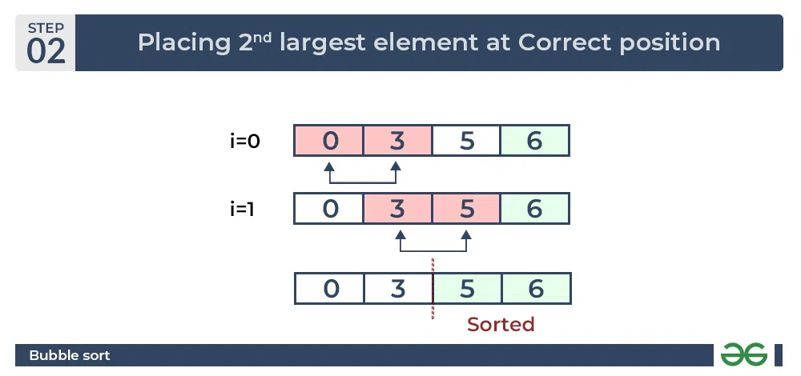
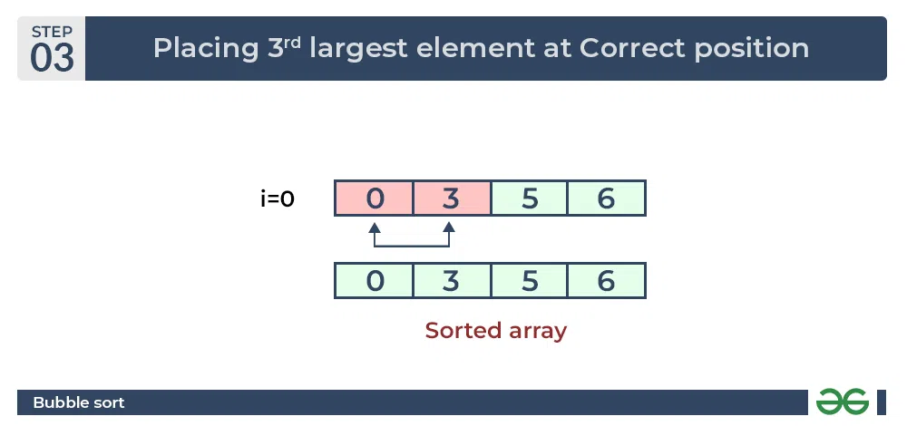

Bubble sort not suitable for large data sets as its average and worst-case time complexity is quite high

##Bubble sort
traverse from left and compare adjacent elements and the higher one is placed at right side.
In this way, the largest element is moved to the rightmost end at first.
This process is then continued to find the second largest and place it and so on until the data is sorted.

Given the array Input: arr[] = {6, 3, 0, 5}

