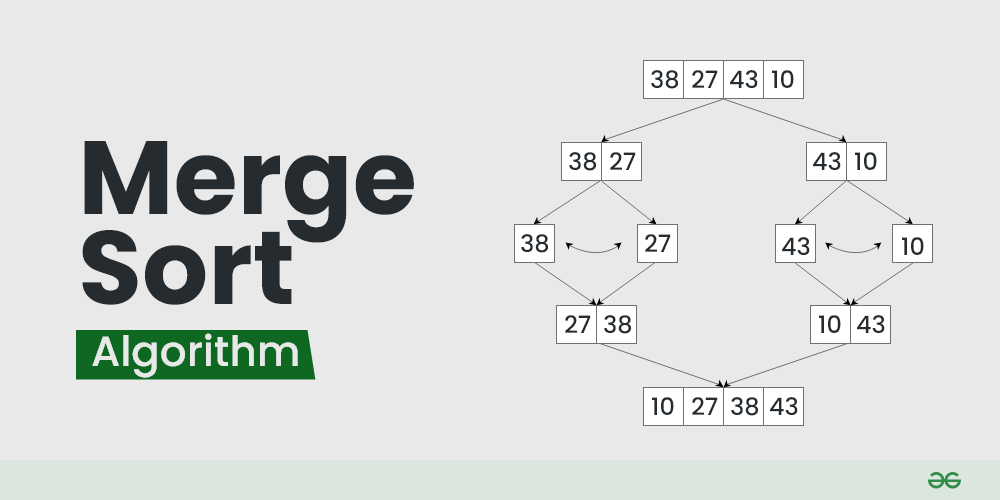
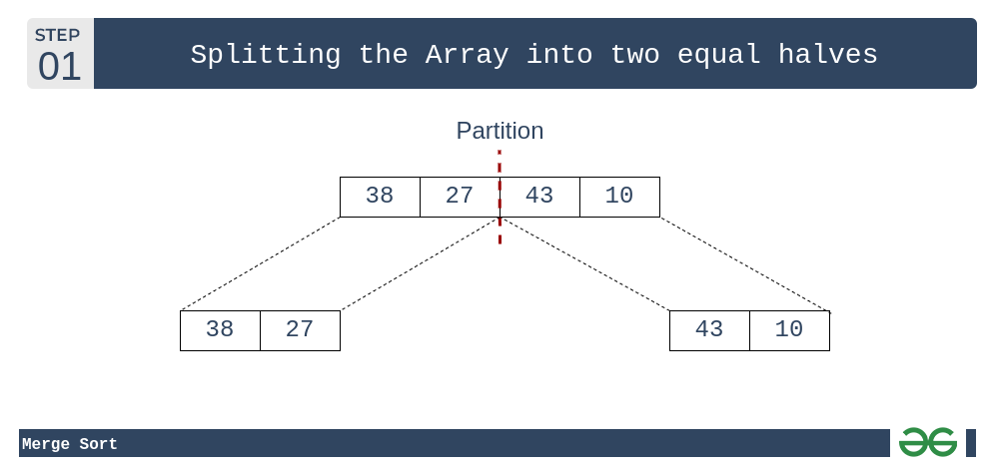
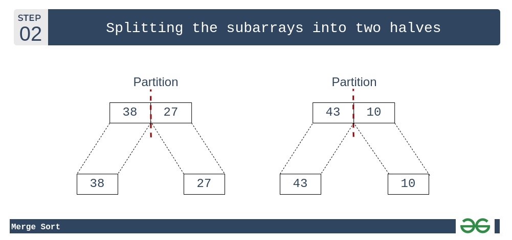
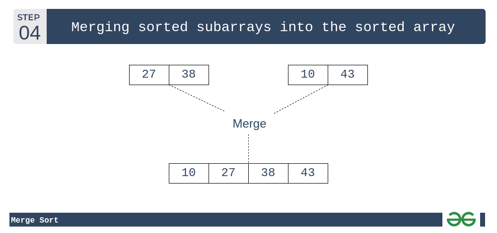

Merge sort is defined as a sorting algorithm that works by dividing an array into smaller subarrays, sorting each subarray, and then merging the sorted subarrays back together to form the final sorted array.

Merge sort is a recursive algorithm that continuously splits the array in half until it cannot be further divided i.e., the array has only one element left (an array with one element is always sorted). Then the sorted subarrays are merged into one sorted array.

let's consider an array arr[] = {38, 27, 43, 10}

Initially divide the array into two equal halves:

These subarrays are further divided into two halves. Now they become array of unit length that can no longer be divided and array of unit length are always sorted.

These sorted subarrays are merged together, and we get bigger sorted subarrays

This merging process is continued until the sorted array is built from the smaller subarrays.

