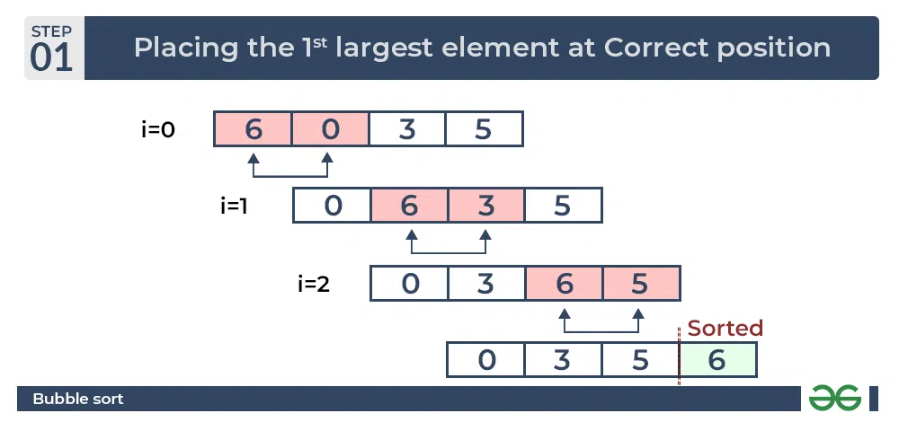
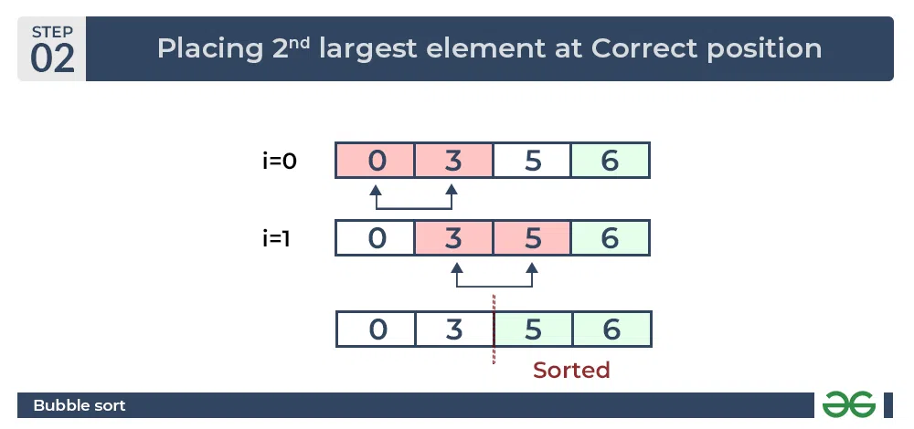
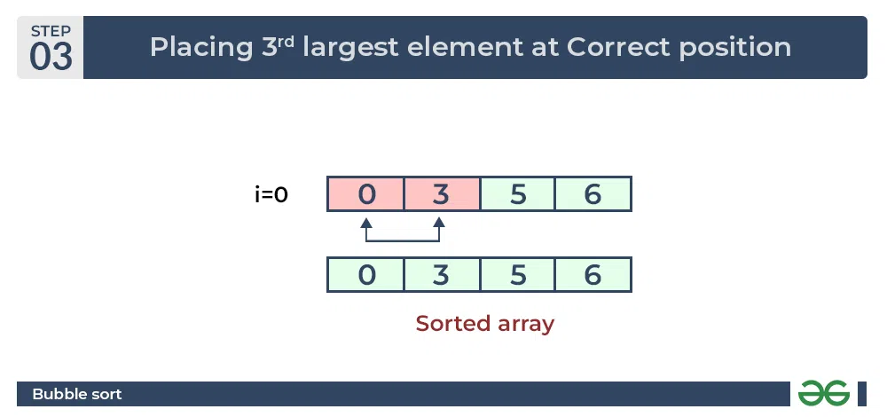

Bubble sort not suitable for large data sets as its average and worst-case time complexity is quite high

To understand how bubble sort works, remember you have a cup of water with different particles,
a particle like stone would go deep down the cup while a particle like paper will remain floated at the top of the water.
so in bublle sort, the heavy numbers are pushed to the extreme end .i.e right while the light elements are pushed to the rear .i.e the left

##Bubble sort
traverse from left and compare adjacent elements and the higher one is placed at right side.
In this way, the largest element is moved to the rightmost end at first.
This process is then continued to find the second largest and place it and so on until the data is sorted.

Given the array Input: arr[] = {6, 3, 0, 5}

